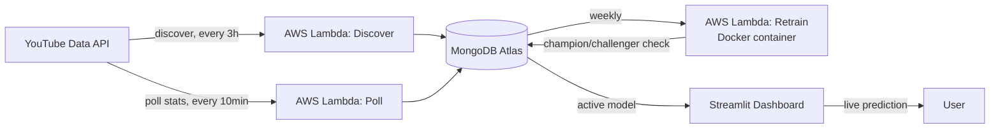

# 📊 Real-Time YouTube Engagement Predictor

A fully automated, cloud-native machine learning system that predicts a YouTube video's engagement rate at ~24 hours post-publish, using only its first 6 hours of performance data.

**🔗 Live Demo:** [your-streamlit-app-url-here](#)

---

## Overview

This project started as a college assignment predicting engagement for 162 videos across 6 YouTube categories, and evolved into a production-grade, self-updating ML pipeline running entirely on AWS at **$0/month**.

The system continuously discovers new videos, tracks their performance in real time, retrains itself weekly, and serves live predictions through a public dashboard — with zero manual intervention required after initial setup.

## Architecture



| Layer | Technology |
|---|---|
| Data collection | AWS Lambda + EventBridge (scheduled) |
| Data storage | MongoDB Atlas (videos, snapshots, models, logs — single source of truth) |
| Model training | scikit-learn Random Forest, hyperparameter-tuned via GridSearchCV |
| Model deployment | Retrained model serialized and stored directly in MongoDB (no local model files) |
| Dashboard | Streamlit, deployed on Streamlit Community Cloud |
| Cost | $0/month — permanent free-tier services only |

## Key Engineering Decisions

- **Root-cause data cleaning, not symptom patching**: discovered YouTube's view-count recalibration (anti-spam filtering) was producing mathematically impossible engagement rates (100%+). Fixed by enforcing monotonic non-decreasing counters via cumulative maximum, rather than clipping the derived rate.
- **Rare-category grouping**: categories with too few training samples are grouped into "Other" rather than getting noisy individual one-hot columns.
- **Outlier exclusion over target capping**: videos with implausible target values are excluded from training entirely, rather than distorting the regression target with an artificial ceiling.
- **Champion/challenger retraining**: a new model only replaces the live one if it performs equal or better on cross-validated R² — prevents automated retraining from silently degrading production quality.
- **Zero-cost cloud design**: deliberately avoided services with time-limited free tiers (S3 for storage, Secrets Manager) in favor of permanently-free alternatives (MongoDB Atlas M0, Lambda Always Free tier).

## Results

| | Original (v1) | Expanded (v2, current) |
|---|---|---|
| Training videos | 162 | 900+ (growing weekly) |
| Categories covered | 6 | 14 (all assignable categories) |
| Cross-validated R² | 0.835 | ~0.58 |
| Cross-validated MAE | 0.64 | ~2.1 |
| Real-world spot-check median error | — | 0.92 percentage points |

*Note: R² decreased with the expanded dataset — this reflects removing artificially easy, homogeneous data in favor of a genuinely diverse, real-world dataset, not a regression in model quality. See [Known Limitations](#known-limitations) below.*

## Features

- **Live prediction**: paste any YouTube URL, get an instant engagement rate prediction with confidence warnings for out-of-distribution inputs
- **Virality scoring**: percentile-based ranking against the full training distribution
- **Category benchmarking**: radar chart comparing a video's early stats against its category average
- **Trend insights**: category-wise and upload-time engagement patterns, computed live from MongoDB
- **Real-world accuracy tracking**: every live prediction is logged and can be checked against actual outcomes once the video reaches 24h old

## Project Structure

```
├── app/
│   └── dashboard.py              # Streamlit dashboard (live, MongoDB-backed)
├── src/
│   ├── youtube_api.py            # YouTube Data API client
│   ├── mongo_setup.py            # MongoDB connection + TTL index setup
│   ├── lambda_discover.py        # Scheduled video discovery (AWS Lambda)
│   ├── lambda_poll.py            # Scheduled snapshot polling (AWS Lambda)
│   ├── lambda_retrain2.py        # Scheduled model retraining (AWS Lambda, Docker)
│   ├── predict_live_v3.py        # Live prediction pipeline (loads model from MongoDB)
│   ├── validate_predictions.py   # Spot-check validation against real data
│   └── check_prediction_accuracy.py  # Forward-looking real-world accuracy tracker
├── notebook/
│   ├── 01_eda_cleaning.ipynb     # Data cleaning + EDA
│   ├── 02_feature_engineering.ipynb  # Feature construction + target labeling
│   └── 03_modeling.ipynb         # Model training + evaluation
├── Dockerfile                    # Container image for the retrain Lambda
├── requirements.txt
└── README.md
```

## Setup (Local Development)

```bash
git clone https://github.com/goutamdepale-byte/01youtube-engagement-predictor.git
cd 01youtube-engagement-predictor
pip install -r requirements.txt
```

Create a `.env` file in the project root:
```
YOUTUBE_API_KEY=your_youtube_data_api_key
MONGODB_URI=your_mongodb_atlas_connection_string
```

Run the dashboard:
```bash
streamlit run app/dashboard.py
```

## Automation Pipeline

| Job | Schedule | Trigger |
|---|---|---|
| Discover new videos | Every 3 hours | AWS EventBridge → Lambda |
| Poll active video stats | Every 10 minutes | AWS EventBridge → Lambda |
| Retrain model | Weekly | AWS EventBridge → Lambda (Docker container image) |

All three run independently of any local machine — the system operates continuously with no manual intervention.

## Known Limitations

- Categories with very few historical samples (Sports, Autos, Travel, Science & Tech) are currently grouped into a single "Other" bucket internally due to limited training data — expected to improve as automated collection continues
- Occasional prediction outliers stem from YouTube's view-count-vs-engagement-count timing behavior, which isn't fully eliminated by the current 50% exclusion threshold
- Model currently only supports YouTube; architecture is designed to extend to additional platforms

## Future Work

- Extend to additional social platforms
- Tighten outlier exclusion thresholds based on ongoing real-world validation
- Add automated failure alerting (CloudWatch → SNS) for the scheduled Lambda jobs

## License

This project is available for educational and portfolio purposes.
